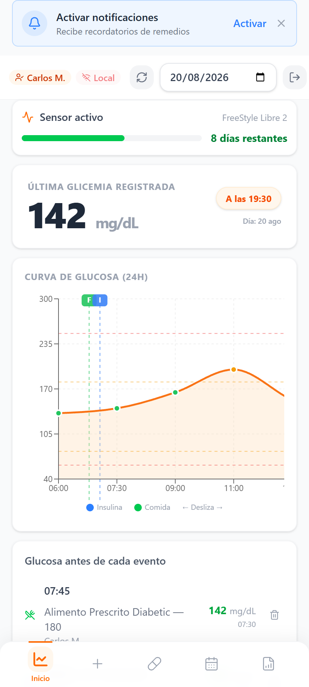
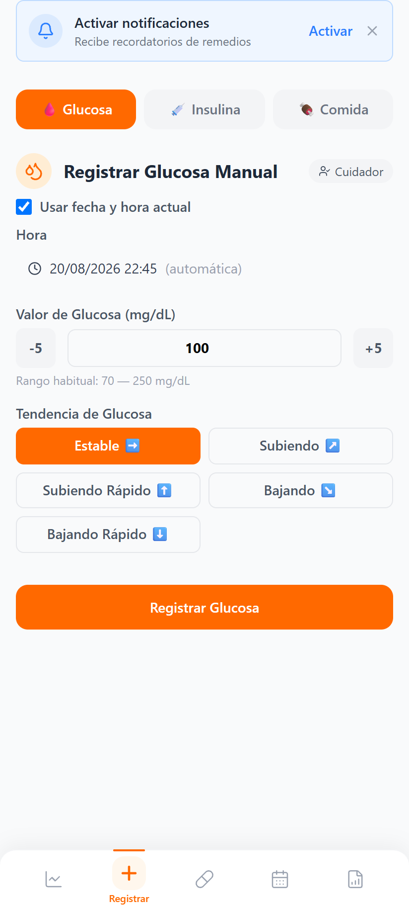
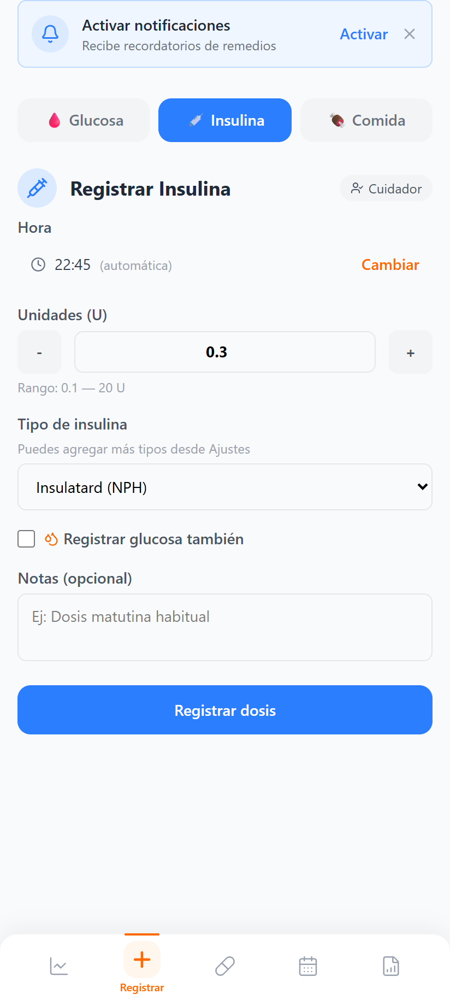
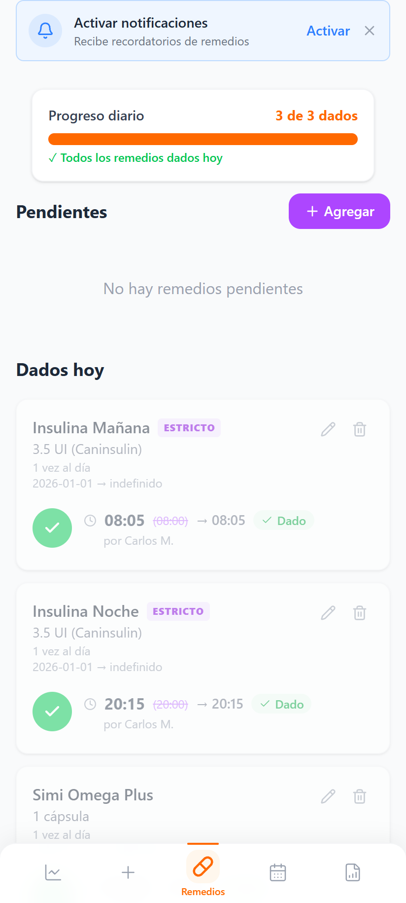
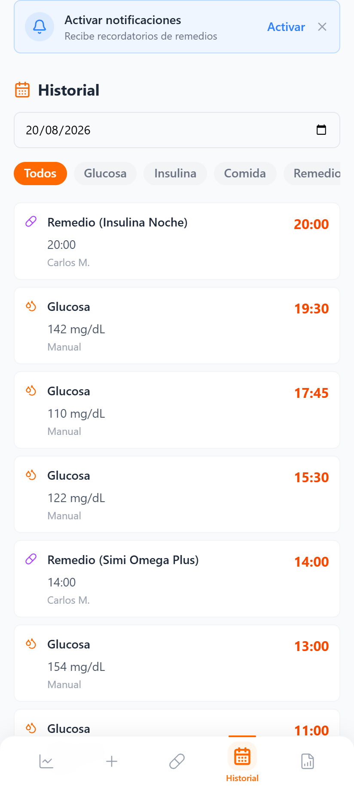
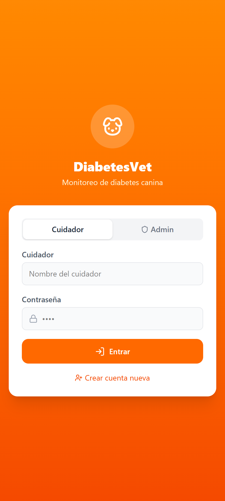

# 🐾 DiabetesVet / Glucosa Frontend

> **Aplicación móvil y PWA (React + TailwindCSS + Capacitor) para el control integral de glucosa, insulina, alimentación y tratamientos en mascotas diabéticas.**

---

## 📸 Vistas Reales de la Aplicación

Todas las capturas a continuación fueron tomadas directamente de los componentes e interfaz real de la aplicación:

### 1. Panel de Control y Monitoreo Continuo (Dashboard)

  
  
<em>Curva interactiva de glucosa en tiempo real con zonas objetivo (80-180 mg/dL), marcas de insulina y comida, estado del sensor y métricas del día.</em>

---

### 2. Registro Rápido de Eventos Diarios

  <table>
    <tr>
      <td align="center" width="50%" valign="top">
        <b>🩸 Registro de Glucosa</b>  
        
      </td>
      <td align="center" width="50%" valign="top">
        <b>💉 Registro de Insulina con Protección</b>  
        
      </td>
    </tr>
  </table>

---

### 3. Tratamientos e Historial Diario

  <table>
    <tr>
      <td align="center" width="50%" valign="top">
        <b>💊 Remedios y Horarios</b>  
        
      </td>
      <td align="center" width="50%" valign="top">
        <b>📅 Historial Diario</b>  
        
      </td>
    </tr>
  </table>

---

### 4. Autenticación y Acceso Seguro

  
  
<em>Inicio de sesión con selección de cuidador o modo Administrador y soporte de cuenta nueva (Signup).</em>

---

## 🚀 Funcionalidades del Sistema

### 1. Ingesta y Conexión de Sensores
El dueño de la mascota vincula sus credenciales de LibreLinkUp en la aplicación. A partir de ese momento, el sistema se conecta automáticamente a los servidores en la nube para importar las lecturas de glucosa sin intervención manual.

* **Integración con LibreLinkUp API (`@diakem/libre-link-up-api-client`)**: Cliente HTTP que interactúa con los servicios de LibreLinkUp, procesando las lecturas periódicamente en segundo plano cada 5 minutos.
* **Banner de estado del sensor y días restantes**: Muestra en la pantalla principal el modelo del sensor activo y el cálculo exacto de días calendario restantes de vida útil, con colores preventivos (verde, amarillo o rojo) cuando el sensor está por caducar o caducado.
* **Registro manual de respaldo**: Permite ingresar mediciones manuales de glucómetro tradicional indicando el valor en mg/dL y la fecha/hora en caso de no contar con sensor continuo.

---

### 2. Panel Principal (Dashboard) y Visualización Clínica
* **Glucosa en tiempo real**: Muestra la última medición resaltada visualmente en rojo para hipoglucemias (<70 mg/dL), verde para rango objetivo (70–250 mg/dL) o amarillo/naranja para hiperglucemias (>250 mg/dL).
* **Gráfico interactivo de curvas glucémicas**: Visualización continua de las curvas de glucosa a lo largo del día con zonas que delimitan los rangos seguros configurados para la mascota.
* **Marcadores visuales de eventos**: Sitúa marcadores en el momento exacto en que se administró una dosis de insulina o se registró una comida, correlacionando el impacto en la curva glucémica.

---

### 3. Registro Clínico y Seguridad de Insulina
* **Algoritmo de prevención de doble dosis**: Si se intenta registrar una dosis habiéndose administrado otra en las últimas 8 horas, el sistema bloquea la acción de inmediato alertando de una posible doble dosis.
* **Modal de alerta crítica de sobredosis**: Despliega advertencia mostrando hora exacta, unidades aplicadas y cuidador responsable, con opciones de cancelación o confirmación estricta.
* **Calculadora rápida de unidades**: Selector interactivo con ajuste fino (±0.1 U) para ingresar con precisión decimal la cantidad de insulina y tipo de fármaco.

---

### 4. Control Horario de Medicamentos
* **Organizador de tomas diarias**: Calcula y lista las tomas del día según su frecuencia (1 vez al día, 2 veces o personalizado).
* **Marcado interactivo con un toque**: Botón de verificación rápida para marcar como "Dado", guardando hora exacta y nombre del cuidador.
* **Ventana de cortesía y estado de puntualidad**: Margen de tolerancia de ±45 minutos. Si se supera, se etiqueta como "Tarde (+X min/hrs)", manteniendo en pendiente los horarios futuros.
* **Soporte para medicamentos estrictos**: Recalcula dinámicamente la hora recomendada para la siguiente dosis en caso de retrasos previos.

---

### 5. Bitácora de Alimentación e Historial
* **Registro de comidas y porciones**: Categorización por tipo (pellet, casera, mix), cantidad exacta y notas de comportamiento o apetito.
* **Historial unificado y filtros por fecha**: Línea de tiempo cronológica completa que consolida lecturas de glucosa, insulina, comidas y medicamentos de cualquier fecha.

---

### 6. Sistema de Notificaciones y Cuentas Familiares
* **Alertas Push automáticas (Firebase FCM)**: Despacho inmediato de notificaciones push de alta prioridad ante hipoglucemias severas, hiperglucemias y recordatorios de medicación.
* **Gestión de roles y cuidadores compartidos**: Accesos diferenciados (Owner y Family) para que múltiples miembros del hogar registren cuidados con permisos protegidos.
* **Sincronización Offline-First**: Permite registrar eventos sin internet y sincronizarlos automáticamente con el servidor central al recuperar la conexión mediante identificadores únicos.

---

## 🛠️ Stack Tecnológico

| Capa | Herramientas / Librerías |
|---|---|
| **Frontend Base** | React 19, TypeScript, Vite 6 |
| **Diseño y Estilos** | TailwindCSS 4, Lucide React Icons |
| **Gestión de Estado** | Zustand (con middleware de persistencia) |
| **Gráficos** | Recharts |
| **Móvil / PWA** | Capacitor 8, Local Notifications, Push Notifications |
| **Fechas y Horarios** | date-fns, date-fns-tz (Zona horaria Chile `America/Santiago`) |

---
